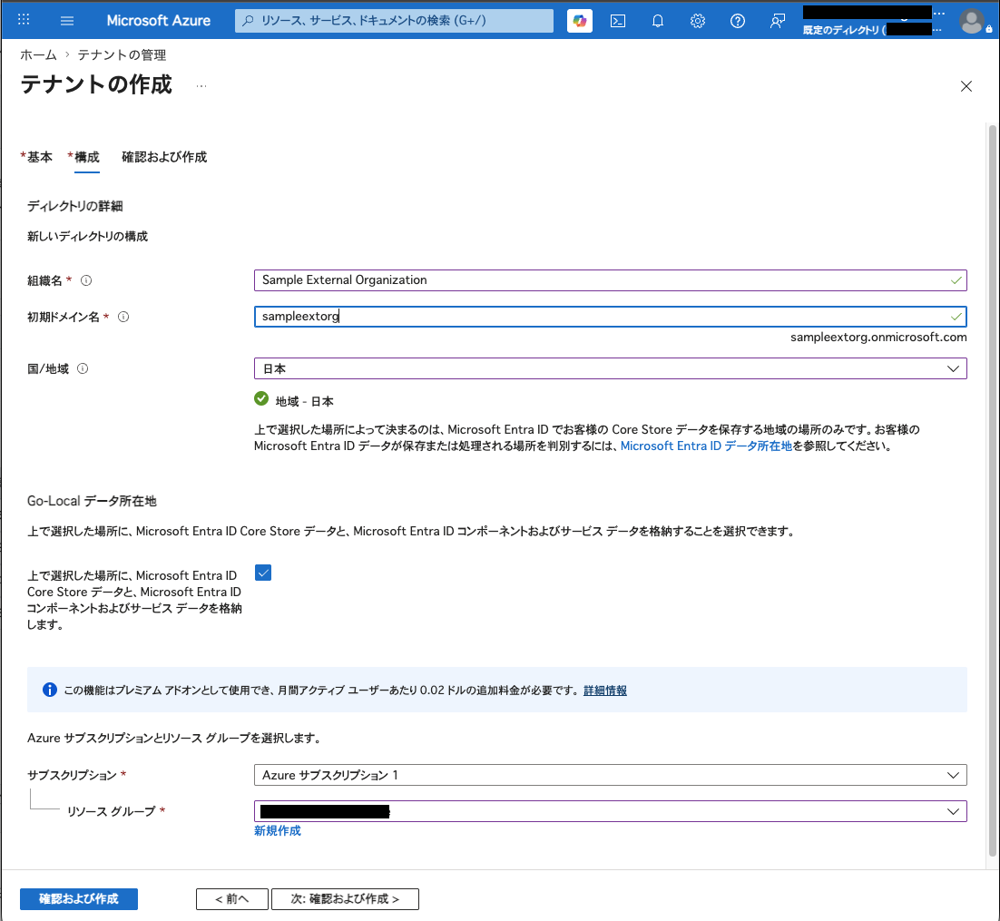
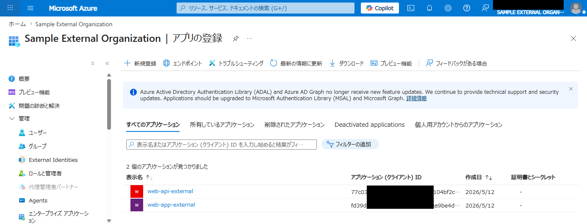
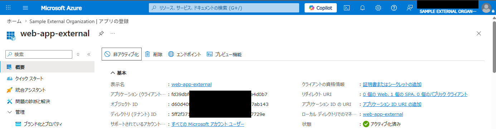
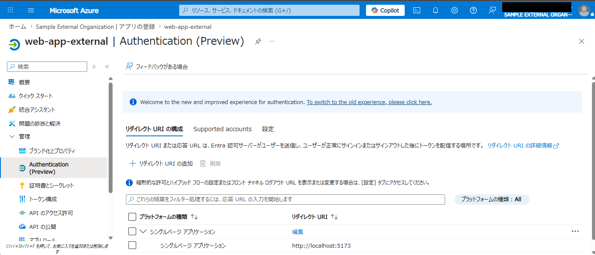
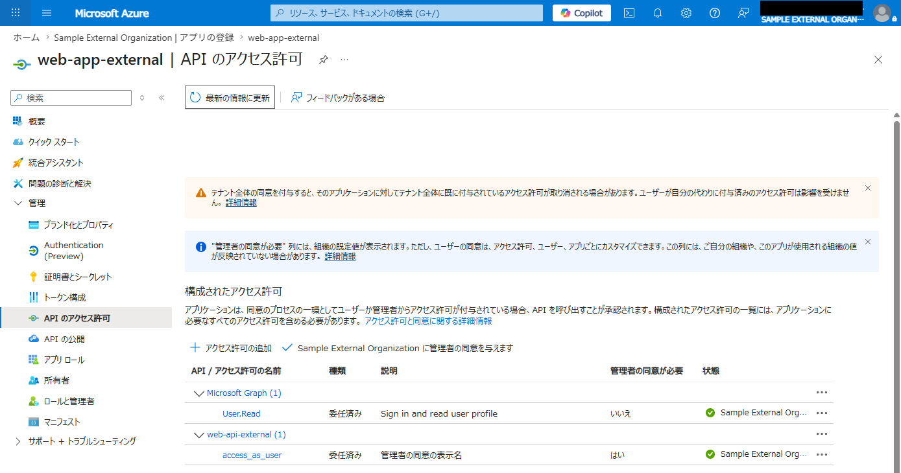
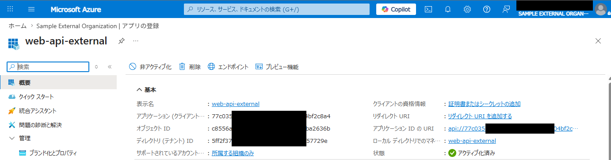
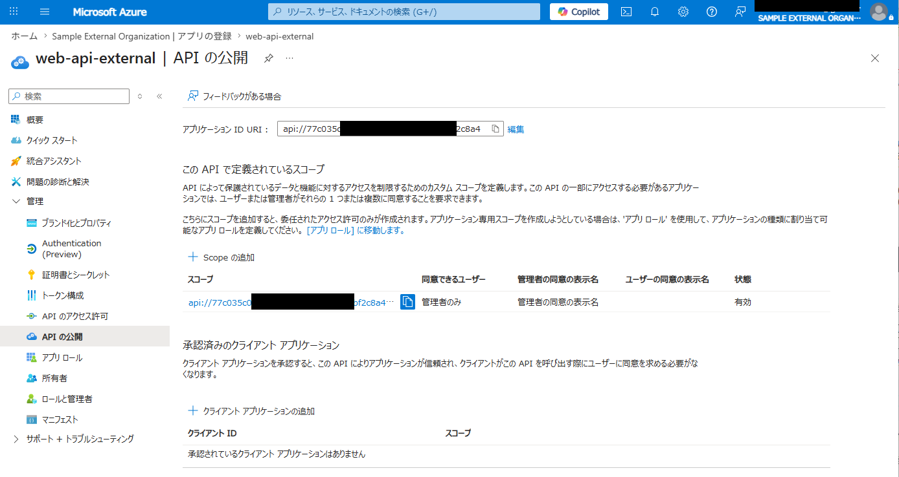

# Entra External ID OIDC Sample SPA

このプロジェクトは、React と `react-oidc-context` を使用して、Microsoft Entra External ID (旧 Azure AD B2C) との OIDC 認証を試すための最低限のサンプルアプリケーションです。

## プロジェクト構成

- `src/main.jsx`: `AuthProvider` による OIDC 設定の初期化
- `src/App.jsx`: `useAuth` フックを使用したログイン状態の管理と UI
- `.env`: 認証設定（テナント ID、クライアント ID）の保持

## セットアップ手順

### 1. Microsoft Entra External ID のテナントを新規作成

1.  [Azure ポータル](https://portal.azure.com/)にアクセスし、「Microsoft Entra ID」を選択します。
2.  ホーム > 既定のディレクトリ | 概要 から、「テナントの管理」を選択します。
3.  「テナントの管理」→「作成」をクリックします。
4.  「テナントの種類を選択する」で「Microsoft Entra 外部 ID」を選択します。
5.  「組織名」「初期ドメイン名」「国/地域」「Go-Local データ所在地」およびAzure サブスクリプションとリソース グループを選択します。
6.  内容を確認して作成します。（テナントの作成には数分かかるので焦らず待ちます）
7.  テナントの作成が完了したら、上記の新規作成テナントにディレクトリを切り替えます。

#### （参考）新規作成の例を以下に掲載しておきます。

* テナントの作成


### 2. Microsoft Entra External ID でのアプリ登録①（SPA）

1.  新規作成テナントで、「Microsoft Entra ID」を選択します。
2.  「アプリの登録」→「新規登録」をクリックします。
3.  名前を入力し（例: `web-app-external`）、サポートされているアカウントの種類（任意の Entra ID テナント + 個人用 Microsoft アカウント）を選択します。
4.  「登録」をクリック後、左メニューの「Authentication」を選択します。
5.  「プラットフォームを追加」→「シングルページ アプリケーション (SPA)」をクリックします。
6.  リダイレクト URI に `http://localhost:5173` を入力し、「構成」をクリックします。
7.  左メニューの「管理」→「マニフェスト」をクリックして「AAD Graph アプリ マニフェスト」のJSONを以下のとおり変更します。
```
変更前: "accessTokenAcceptedVersion": null,  ← v1.0 トークンを発行（デフォルト値）
変更後: "accessTokenAcceptedVersion": 2,     ← v2.0 トークンを発行
```

### 3. Microsoft Entra External ID でのアプリ登録②（API）

1.  新規作成テナントで、「Microsoft Entra ID」を選択します。
2.  「アプリの登録」→「新規登録」をクリックします。
3.  名前を入力し（例: `web-api-external`）、サポートされているアカウントの種類（シングルテナントのみ）を選択します。
4.  「登録」をクリック後、左メニューの「API の公開」を選択します。
5.  「アプリケーション ID URI」とスコープ（スコープ名：`access_as_user`）を追加します。
6.  左メニューの「管理」→「マニフェスト」をクリックして「AAD Graph アプリ マニフェスト」のJSONを以下のとおり変更します。
```
変更前: "accessTokenAcceptedVersion": null,  ← v1.0 トークンを発行（デフォルト値）
変更後: "accessTokenAcceptedVersion": 2,     ← v2.0 トークンを発行
```
7.  ひとつ前に作成したアプリ「web-app-external」の「API のアクセス許可」から作成したAPIアプリへのアクセス許可を追加します。

#### （参考）アプリ登録①、②の設定例を以下に掲載しておきます。

* Sample External Organization | アプリの登録　→　すべてのアプリケーション
  

##### アプリ登録①（SPA）

* 概要
  

* 管理 -> Authentication (Preview)：リダイレクトURIの構成
  

* 管理 -> API のアクセス許可
  

##### アプリ登録②（API）

* 概要
  

* 管理 -> API の公開
  

### 4. 環境変数の設定

ローカル開発用の設定ファイルを作成します。Vite の仕様により、`.env.local` ファイルは自動的に読み込まれ、他の設定ファイルよりも優先されます。

1.  `.env.sample1` または `.env.sample2` をコピーして `.env.local` を作成します。
2.  `.env.local` 内の以下の値を実際の環境に合わせて書き換えます。
    - `VITE_OIDC_AUTHORITY`: `https://{initial_domain_name or organization_id}.ciamlogin.com/{initial_domain_name or organization_id}.onmicrosoft.com/v2.0`
    - `VITE_OIDC_CLIENT_ID`: 登録したSPAアプリの「アプリケーション (クライアント) ID」
    - `VITE_OIDC_SCOPE`: 要求するスコープ（例: `openid profile email  api://{your_api_client_id}/.default`）。

### 5. アプリケーションの実行

使用する設定ファイルに応じて、以下のコマンドで起動します。

```bash
# 依存関係のインストール
npm install

# 個人設定 (.env.local) を使用して起動
# ※ Vite の仕様により、.env.local が存在すれば自動的に優先読み込みされます
npm run dev

# .env.sample1 を使用して起動
npm run dev:sample1

# .env.sample2 を使用して起動
npm run dev:sample2
```

起動後、 `http://localhost:5173` にアクセスしてください。


## 使い方

1.  **Log in**: クリックすると Entra External ID のサインイン画面にリダイレクトされます。
2.  **認証後**: ログインに成功すると、画面に取得したユーザーのプロファイル情報（ID トークンのクレーム）が表示されます。
3.  **Log out**: クリックすると Entra External ID からサインアウトし、アプリケーションに戻ります。
4.  **Clear Storage**: ローカルに保存されているセッション情報をクリアします（デバッグ用）。

## 技術情報

- **ライブラリ**: `react-oidc-context` ( `oidc-client-ts` の React ラッパー)
- **認証フロー**: Authorization Code Flow with PKCE (SPA で推奨されるフロー)
